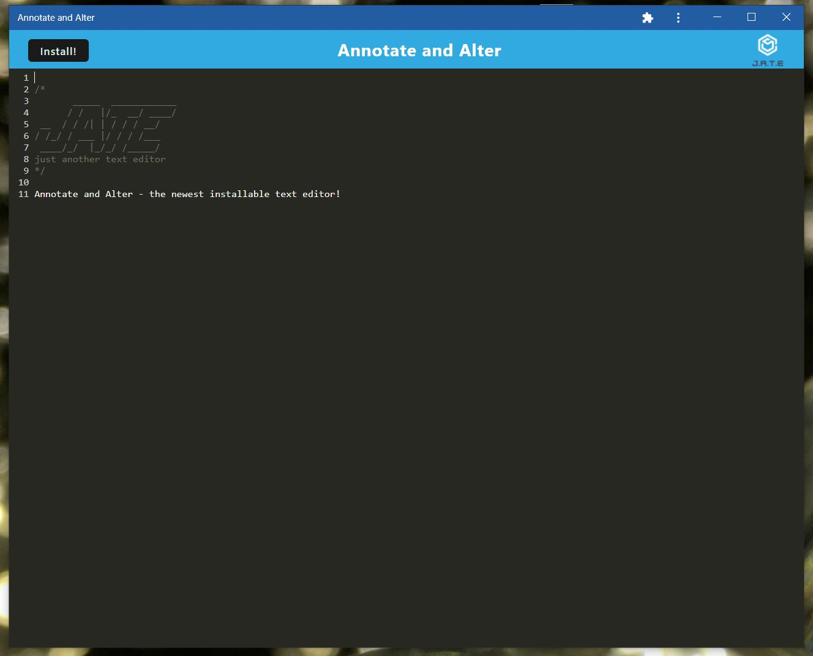
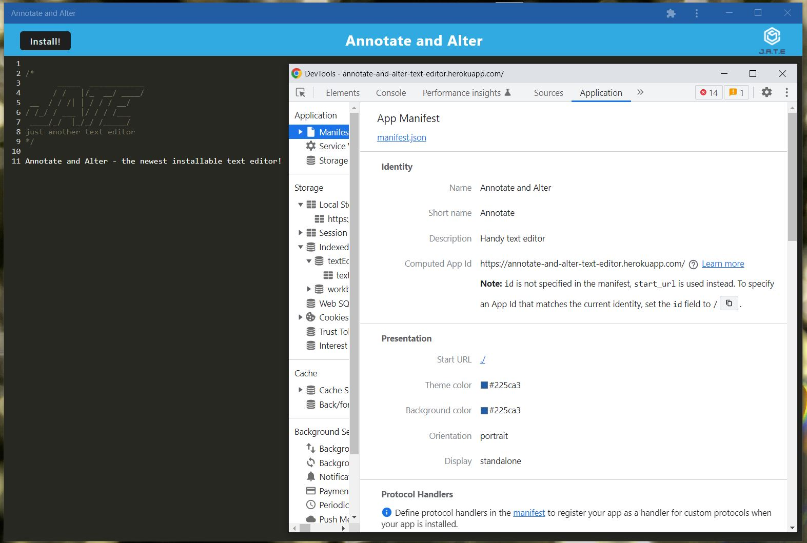
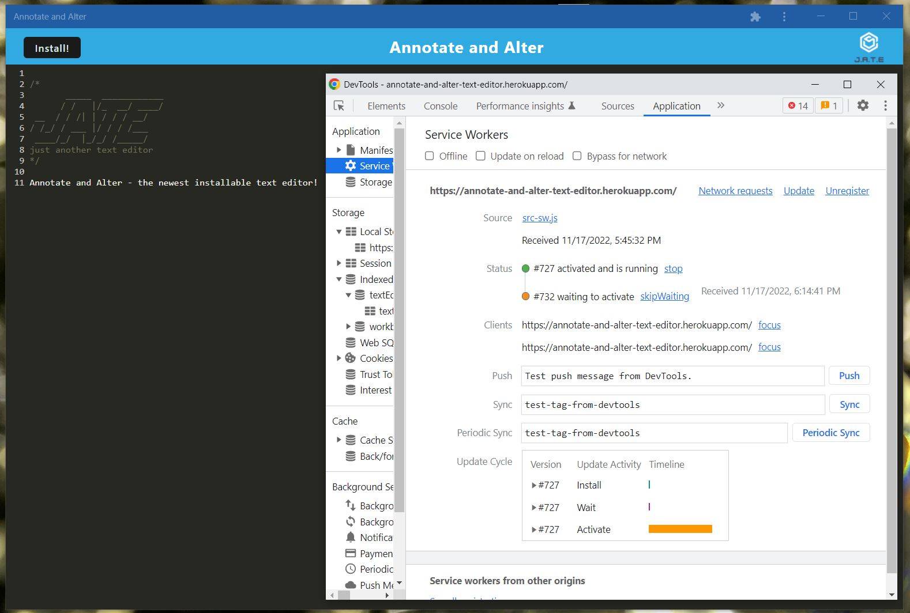

# Annotate and Alter

This is a handy text editor with a twist - it works offline and is installable too!

## Table of Contents

- [Description](#description)
- [Deployed Application](#deployed-application)
- [Future Improvements](#future-improvements)
- [Usage](#usage)
- [Credits](#credits)
- [License](#license)

## Description

This is a simple and incredibly handy text editor that allows you to save notes whenever, wherever - no online connection needed. If you have an unsteady internet connection, this app also allows you to continue writing and saving notes without having to restart with the connection is restored. Best yet, it's installable as an app on your computer or mobile device so that even more convenient functionality is at your fingertips. For just another text editor, this one is pretty cool.

## Deployed Application

Heroku deployed link: https://annotate-and-alter-text-editor.herokuapp.com/

## Future Improvements

- Can always upgrade the styling/UI from the starter code template given.

## Usage

Below are screenshots of Annotate and Alter:

## Credits

Collaborators:

TA: Faizan Ali

Instructor: Firmin Saint-Amour

## License

No licenses (default copyright laws apply).

---
